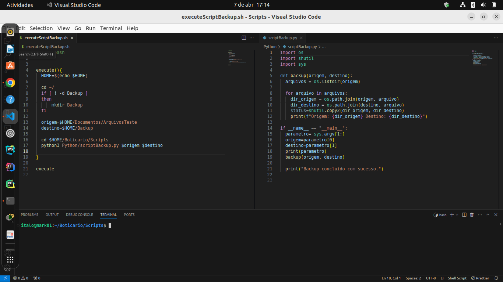
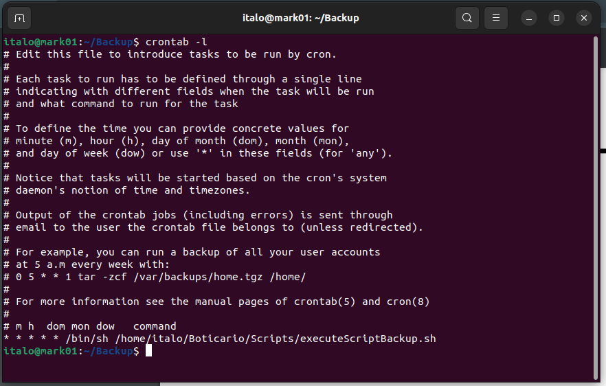
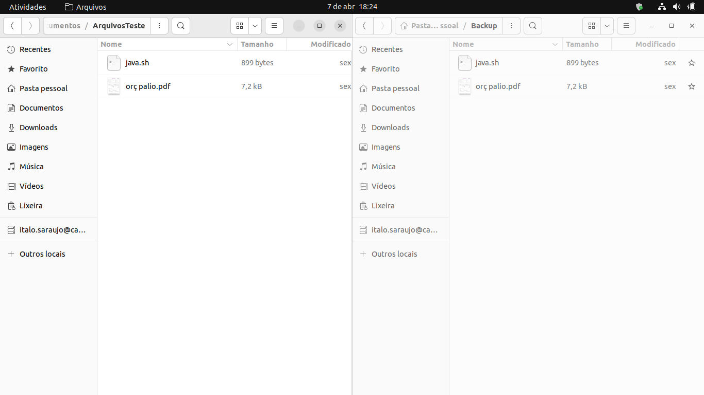

#Projeto Automatização Backup # 

[Roteiro do projeto](https://docs.google.com/document/d/1TKWtE9-2tH8v9-H_ahCH04DlHizMDq3Cc-8ZGo77YCo/edit)

 Segundo o descritivo do projeto 01 do Programa Desenvolve 2024 do GRUPO Boticário desenvolvi dois script, em shell script para sequenciar os comando de execução do backup via script python. Em seguida usei o agendamento pelo crontab para gerar uma cópia dos arquivos a cada minuto. Um pouco exagerado, as repetições considerando a possinilidade de um cenário e quantidade de arquivos, tanhamo ou mesmo volume maior.

## Sequencia de passos em fotos

### Codigo fontes

 A esquerda da imagem temos o shell script executando o script pyhton para realizar o backup com o codigo python a direita da tela.

A esquerda arquivos de origem e a direita arquivos em copia de segurança.

### Etapas para uso Persnonalizando a sua necessidade.

1. Caso deseje usar o script em shellscript para criar uma copia de segurança dos seus arquivos pessoais, profissionais ou mesmo de um projeto. 
Atencao: edite a variaveis origem (Diretorio a qual deseja efetuar copia de segurança) e destino (diretorio ou dispositivo a qual deseje salvar 
seus arquivos). 

2. Explicando uso de biblitecas no script python:

   a. Biblioteca OS foi usada para fazer a união dos arquivo e o diretorio atrubuindo o retorno da função para arquivos de origem e destino.

   b.    ''      SHUTIL foi usada para a copia usando dois parametros, diretorios de origem a destino.

   c.    ''      SYS para salvar a lista de parametros usada para quando invocar o script python. 

